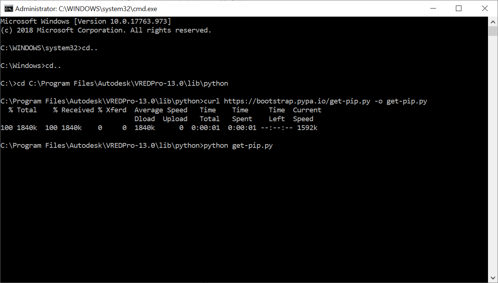

# Installation guide

Requires VRED 2021
To run speech recognition in your VRED you first need to download and install the speech recognition library. 
PyAudio is required to use and enable the microphone input.

## Installing pip
Open the Windows Command Line in Admin Mode. (Windows-r and type CMD and Press CTRL-SHIFT-RETURN to start as Admin)

Tpye `cd C:\Program Files\Autodesk\VREDPro-13.0\lib\python`

To install pip in your system first write following command  to download get -pip.py file:

`curl https://bootstrap.pypa.io/get-pip.py -o get-pip.py`

Then run the following command in the folder where you have downloaded get-pip.py:

`python get-pip.py`

You should get the feedback: Successfully installed pip-xx.x

If you encounter any error then follow these steps:
1. Download [pip37.zip](https://github.com/simonnagel/VRED-voiceRecognition/raw/master/sources/pip37.zip)
2. Extract to `C:\Program Files\Autodesk\VREDPro-13.0\lib\python\Lib\site-packages`

Pip is now installed!

To check your pip version and to confirm pip has been installed correctly run the command:

`python -m pip --version`

## Speech Recognition

Open the Windows Command Line in Admin Mode. (Windows-r and type CMD and Press CTRL-SHIFT-RETURN to start as Admin)

Tpye `cd C:\Program Files\Autodesk\VREDPro-13.0\lib\python`

`python -m pip install SpeechRecognition`

Once the installation is finished you can verify the installation by writing the following code into your VRED terminal:

`>>> import speech_recognition as sr`
`>>> sr.__version__`
`>>> ‘3.8.1’`

## PyAudio

Open the Windows Command Line in Admin Mode. (Windows-r and type CMD and Press CTRL-SHIFT-RETURN to start as Admin)

Tpye `cd C:\Program Files\Autodesk\VREDPro-13.0\lib\python`

`python -m pip install PyAudio`

If you encounter an error message: 
`“error: Microsoft Visual C++ 14.0 is required”`

Download [PyAudio-0.2.11-cp37-cp37m-win_amd64.whl](https://github.com/simonnagel/VRED-voiceRecognition/raw/master/sources/PyAudio-0.2.11-cp37-cp37m-win_amd64.whl) 
original source [https://www.lfd.uci.edu/~gohlke/pythonlibs/#pyaudio](https://www.lfd.uci.edu/~gohlke/pythonlibs/#pyaudio)

Now, open terminal in the folder where the file is downloaded.
Press shift + right click in the folder (click anywhere in the empty space) and click on “Open Powershell Window Here”
Now in the terminal write the following command:

`python -m pip install PyAudio-0.2.11-cp37-cp37m-win_amd64.whl`

### Sources: 
[How to install pip](https://pip.pypa.io/en/stable/installing/)

[Speech Recognition](https://pypi.org/project/SpeechRecognition/#description)

[PyAudio](https://pypi.org/project/PyAudio/#files)

[How to install packages in python](https://packaging.python.org/tutorials/installing-packages/)
